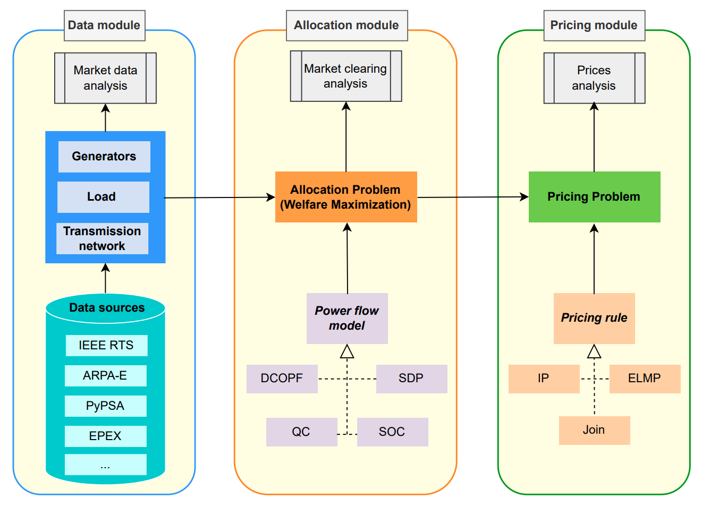

# APEM - Allocation and Pricing in Electricity Markets



## Installation
<details>
  <summary> After cloning the code, the following setup steps need to be performed once before running the code. </summary>

  <br>**Note:** The setup instructions assume a Linux-based or Windows OS and require Python 3.10 (or higher). 

  ### 1. Virtual environment
  - Create a virtual environment (alternatively, you can use `virtualenv` or whatever you prefer) - you may choose any name (e.g., "apem-venv"):
  ```bash
  python -m venv <venv_name>   # Example: python -m venv apem-venv
  ```

  **Note:** You can specify the Python version for the virtual environment, e.g., `python3.11 -m venv <venv_name>`. The specified version already needs to be installed in the system. If you only specify "python3", the venv uses the standard python3 version from the system. When working with _virtualenv_, the command would be _virtualenv - p python3 <venv_name>_.

  - Activate the virtual environment:
  ```bash
  # Linux:
  source ./<venv-name>/bin/activate        # Example: source ./apem-venv/bin/activate

  # Windows: 
  source <venv-name>/Scripts/activate      # Example: source apem-venv/Scripts/activate
  ```

  **Note:** The virtual environment can be deactivated using `deactivate`- however, for the next steps, we want the virtual environment to be active.


  ### 2. Install required packages
  - Install all requirements from the `requirements.txt` file:
  ```bash
  pip install -r <path-to-requirements.txt>   # Example: pip install -r requirements.txt
  ```

  ### 3. Gurobi license
  To run the code, a valid academic or commercial Gurobi license is required ([more information](https://gurobi.com/unrestricted)).
  - If you do not already have such a license, you first need to create one together with API keys: 
    - Log into the Gurobi [user portal](https://portal.gurobi.com/iam/home/) > Licenses > Request > Choose your license (for academic, you can either use _WLS Academic_ - e.g., required when using WSL - or _Named-User Academic_) > Generate Now! &rarr; license is now listed under "Licenses"
    - Open Gurobi [Web License Manager](https://license.gurobi.com/manager/licenses/) > API Keys > Create API Key (make sure you create them for your new license: check ID) > Download keys
  - Finally place the `gurobi.lic` file in your `home directory`
</details>

## Usage
**Note:** Make sure to always activate your virtual environment before running the code!

Before running the code, update the [`config.json`](./config.json) file to create a configuration that will be run.

The most important section is `scenario`, which defines the dataset, market model, power flow model, pricing, and redispatch algorithm.

```jsonc
"scenario": {
    "market_model": "EU_model",    // choose from _available_market_models
    "US_dataset": "ARPA",          // choose from _available_US_datasets
    "EU_dataset": "GME",           // choose from _available_EU_datasets
    "power_flow_model": {
        "type": "DCOPF"            // choose from _available_power_flow_models
    },
    "cut_type": "price based",     // choose from _available_cut_types
    "pricing_algorithm": "IP",     // choose from _available_pricing_algorithms
    "redispatch_algorithm": "MinCostRD",  // choose from _available_redispatch_algorithms 
    "redispatch_constraint_units": false, // controls whether some units should not be redispatched
    "redispatch_threshold": 0.001 // in MW, controls what units can be redispatched
}
```

### Available options

- **Market models**: `US_model`, `EU_model`
- **Datasets**
  - US: `IEEE_RTS`, `PJM`, `PyPSAEurSmall`, `PyPSAEurLarge`, `ARPA`
  - EU: `Generated Small`, `Generated Large`, `OMIE`, `GME`, `IEEE_RTS`, `ARPA`, `PyPSAEurSmall`, `PyPSAEurLarge`, `PJM`
- **Power flow models** (only for ``US_model``): `DCOPF`, `Zonal_NTC`
- **Cut types** (only for `EU_model`): `price based`, `combinatorial benders`, `no good`
- **Pricing algorithms** (only for `US_model`): `ELMP`, `IP`, `MinMWP`, `Join`
- **Redispatch algorithms** (only for `US_model/Zonal_NTC`): `MinCostRD`, `MinAbsCostRD`, `MinAbsVolRD`
- **Zonal configurations** (only for `US_model/Zonal_NTC`): `national`, `zonal_DE2-k`, `zonal_DE2-s`, `zonal_DE3`, `zonal_DE4`, `zonal_DE4-refined`, `zonal_DE5`

Other global settings like solver tolerances and runtime limits can be adjusted under `"solver_configuration"`. Zonal-specific settings are under `"zonal_configuration"`.

---
To run the configuration, execute:
```bash
python main.py
```

Once the execution is done, a new `results` folder will be created storing detailed allocation and pricing results.

**Note:** If you ever run into the error "ModuleNotFoundError: No module named 'src'", this can likely be resolved by setting the PYTHONPATH inside your virtual environment. To do this, add the following line to <venv_name>/bin/activate: `export PYTHONPATH=/<path-to-APEM>`.

## Using Your Own Data for the US Model

Besides the datasets that are already provided in APEM, you can run the available methods using other datasets.
This guide shows how to plug **your custom dataset** into APEM so you can run allocation, pricing, and redispatch on top of your own bids and networks.

---

### What APEM expects at runtime

Your parser must return a `Scenario` object with the following pieces:

- **df_sellers (DataFrame)** — one row per (seller, period).
  - Required columns (minimum):
    - `seller` *(int/str)* — unique generator/unit id  
    - `period` *(int >= 1)* — time index (1..T)  
    - `node` *(int/str)* — network bus or zone id  
    - `max_prod` *(float, MW)* — total available production in the period  
    - `min_prod` *(float, MW)* — technical minimum  
    - `min_uptime` *(int, hours or periods)* — minimum up time (0 if not modeled)  
    - `no_load_cost` *(float, cost/unit time)* — fixed on-cost  
    - **Block offers used to create a stepwise cost curve:** `size1..sizeK` *(MW)* and `cost1..costK` *(currency/MWh)*

- **df_buyers (DataFrame)** — one row per (buyer, period).
  - Required columns (minimum):
    - `buyer` *(int/str)* — unique demand id  
    - `period` *(int >= 1)*  
    - `node` *(int/str)*  
    - `inelastic_dem` *(float, MW)* — must‐serve part of demand  
    - **Block bids (if any) used to create a stepwise valuation curve:** `size1..sizeL` *(MW)* and `val1..valL` *(currency/MWh)*  
    - `max_dem` *(float, MW)* — inelastic + sum of `size*`

- **network (networkx.Graph)** — buses as nodes, branches as edges.
  - Edge attributes (for `US_model/DCOPF`):  
    - `B` *(float)* — line susceptance  
    - `F_max` *(float, MW)* — thermal limit 
  - For zonal networks you may pass a single node graph.

- **nodes_agents (dict)** — mapping `node -> {"sellers": [...], "buyers": [...]}`.

- **periods (list[int])** — e.g., `[1, 2, ..., 24]`.

- **blocks_buyers (range)** — e.g., `range(1, 3+1)` for 3 buyer blocks.

- **blocks_sellers (range)** — e.g., `range(1, 4+1)` for 4 seller blocks.

- **r_star** — reference node (slack) id.

Return them via:

```python
return Scenario(dataset_name, df_buyers, df_sellers, network, nodes_agents, periods, blocks_buyers, blocks_sellers, r_star)
```

Note: Period indexing in APEM examples starts at 1. Keep it consistent.

### Where to put your raw data

Place your files under:
```python 
apem/US_market_model/data/raw/<your_dataset_name>/
```

### Minimal template:
```python
from collections import defaultdict
import pandas as pd
import networkx as nx

from apem.US_market_model.data.parsing.parse_data import ParseData
from apem.US_market_model.data.parsing.scenario import Scenario
from apem.US_market_model.utils.paths import RAW_DATA_DIR

class ParseMyDataset(ParseData):
    def parse_data(self, day=None) -> Scenario:
        path = RAW_DATA_DIR / "my_dataset"  # folder with your raw files

        # --- Sellers ---
        df_sellers = pd.read_csv(path / "sellers.csv")
        # ensure required columns exist / are computed
        # e.g., build block columns size1..sizeK and cost1..costK

        # --- Buyers ---
        df_buyers = pd.read_csv(path / "buyers.csv")
        # compute inelastic_dem, val*, max_dem, etc.

        # --- Network ---
        network = nx.read_edgelist(path / "network.csv", delimiter=",", nodetype=str)
        # For DCOPF add edge attributes B and F_max

        # --- Nodes→agents mapping ---
        nodes_agents = defaultdict(lambda: {"sellers": [], "buyers": []})
        for n, group in df_sellers.groupby("node"):
            nodes_agents[n]["sellers"].extend(sorted(group["seller"].unique()))
        for n, group in df_buyers.groupby("node"):
            nodes_agents[n]["buyers"].extend(sorted(group["buyer"].unique()))

        periods = sorted(df_buyers["period"].unique().tolist())  # or define explicitly
        r_star = str(periods and df_sellers["node"].iloc[0])      # pick a slack bus sensibly
        blocks_buyers = range(1, 1 + 1)   # adjust to your data
        blocks_sellers = range(1, 4 + 1)

        return Scenario("MY_DATASET", df_buyers, df_sellers, network, nodes_agents, periods, blocks_buyers, blocks_sellers, r_star)
```

### Concrete examples (from the repo)

Use these patterns when adapting your own sources:

#### 1. PJM pattern (single-node market with many seller blocks)
* Collapses the network to a single node (pure energy market case).
* Ensures every (seller, period) has a row; missing periods are filled with zeros.
* Uses ``valuations.csv`` to mock buyer valuations.
* See: ``ParsePJM``.

#### 2. ARPA pattern (rich network + 4 seller blocks, 3 buyer blocks)
* Sellers and buyers are read from ``case.json`` (with ``cblocks``), enriched with CSVs.
* Susceptance `B` is computed from resistance/reactance and clamped: `B = Im(1/(R + jX))` with bounds `[0.01, 2]`.
* See: `ParseARPA`.

----
### Hooking your dataset into `config.json`
1. Add your parser class (e.g., ParseMyDataset) in the `US_market_model/data/parsing` package.
2. Add your dataset to `enums.py` in the `US_Datasets` class.
3. Select your dataset in `config.json`.