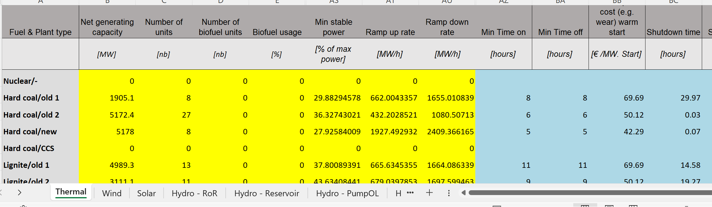
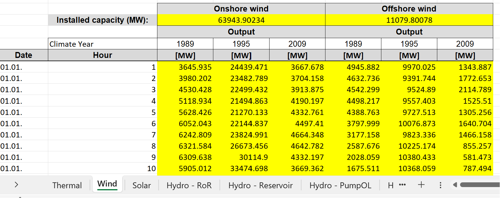
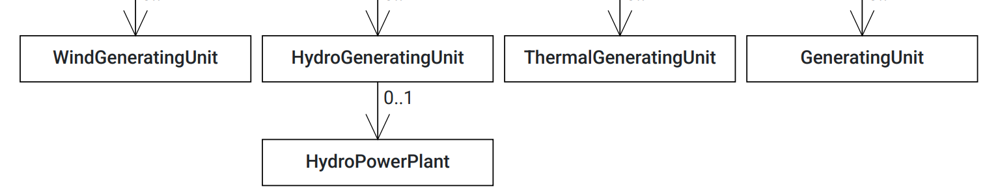
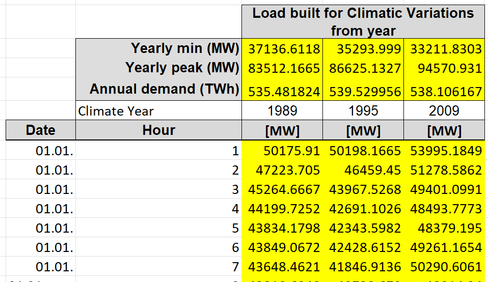
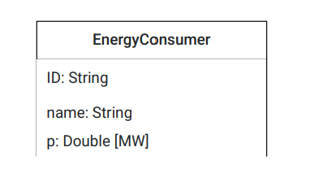
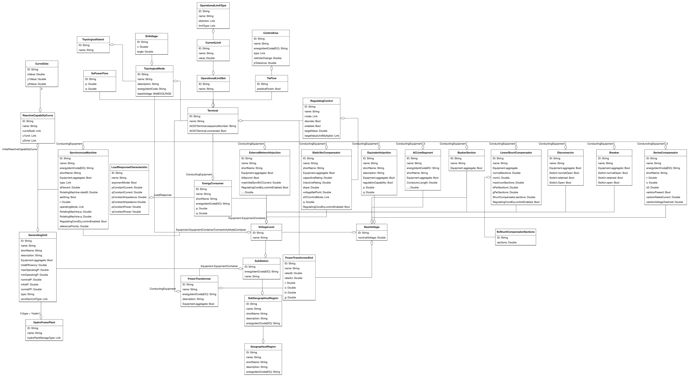

# Overview of Data Sources
This document provides a brief overview of previously used data sources and required data for the project.

## Existing Data Sources
We discuss the ARPA-E Grid Competition data as well as the Bidding Zone Review data published as part of the LMP study.

### ARPA-E Grid Optimization Competition
- Links: https://gocompetition.energy.gov/challenges/challenge-2, data description https://gocompetition.energy.gov/sites/default/files/Challenge2_Problem_Formulation_20210531.pdf
- Scope: single-hour, network sizes between 600 and 32,000 nodes
- Generation: node id, minimum and maximum real and reative power, ramping rates, start-up costs, no-load costs, piecewise-constant variable costs
- Load: node id, minimum and maximum active and reactive power demand, ramping rates, piecewise-constant valuation functions
- Grid: bus voltage magnitude, bus voltage angle, line resistance, line reactance, thermal limit, shunts & transformers (neglected)
- Limitations: no real-world data, resemble U.S. networks, no time series

### Bidding Zone Review Data
- Links: https://www.entsoe.eu/network_codes/bzr/; two main datasets: input files and grid model
- Scope: European network (we just considered Germany), time series for three climate years, generation and demand scenarios for 2025
- Generation: 
    - Input files: 
        - minimum/maximum power, ramp rates, min time on/off, start-up costs, type (e.g. Hard Coal Old 1) for thermal units (from PEMMDB) \
        
        - aggregate hourly RES production for Germany (from PECD) \
        
    - Grid model: 
        - broad category of type (e.g. Thermal) \
         
        - we mapped thermal units with input files through Marktstammdatenregister and a heuristic
        - we distributed RES output across all RES units proportional to their nominal capacities (except dispatchable hydro)

- Load: 
    - Input files: aggregate hourly load for Germany \
     
    - Grid model: base load (p) \
      
    - we distributed the hourly demand from the input files proportional to the base load
    
- Grid: comprehensive representation of the grid; we used topological nodes, excluded breakers and disconnectors, added some missing data from JAO static grid, and assigned coordinates to substations based on OpenStreetMap \
  

- Limitations: many assumptions/simplifications required, no demand valuations, no variable/fixed costs for RES (added from literature), no fixed costs for thermal units (added from literature)

## Required Data/Input - either TenneT or public information
- Generation: generation characteristics on a nodal level, time series for fuel costs and weather  
- Load: better understanding of nodal or at least regional demand time series, demand valuation
- Grid: ideally coordinates for each topological node, know-how to model grid in better detail (e.g. breakers, disconnectors, transformers), border constraints for Germany (ideally as time series)

## Open Questions
- Modeling of flow-based coupling? Requires (ideally time-series) information about PTDF, RAM, CNE
- Modeling of storage units? Demand-flexibility? 
- Euphemia: heuristic to map bids from e.g. EPEX spot to locations (e.g. TSO regions)

